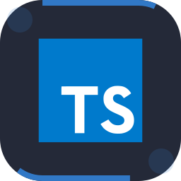
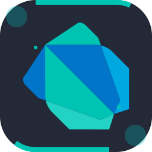
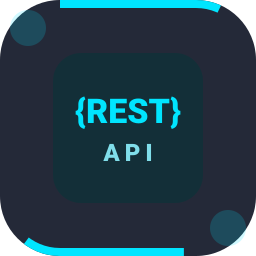
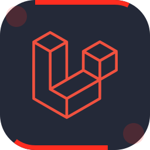
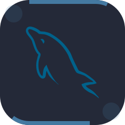
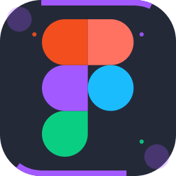
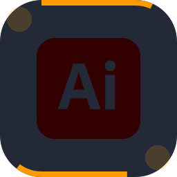

# Hi there, I'm Muhammad Fikri Haikal! 👋

  

  
  
  

---

## About Me

I am a Software Engineering student passionate about technology, web & mobile development, and IoT & Cloud computing. I enjoy building innovative projects, expanding my technical skill set, and turning complex problems into simple, elegant, and maintainable solutions.

---

## Technologies & Tools

> Tools, languages, and frameworks that I work with:

<table align="center">
  <!-- Row 1: Languages & APIs -->
  <tr>
    <td align="center" width="96">
      
       JavaScript
    </td>
    <td align="center" width="96">
      
       TypeScript
    </td>
    <td align="center" width="96">
      
       Python
    </td>
    <td align="center" width="96">
      
       PHP
    </td>
    <td align="center" width="96">
      
       Dart
    </td>
    <td align="center" width="96">
      
       HTML
    </td>
    <td align="center" width="96">
      
       CSS
    </td>
    <td align="center" width="96">
      
       Rest API
    </td>
  </tr>

  <!-- Row 2: Frameworks & Libraries -->
  <tr>
    <td align="center" width="96">
      
       Laravel
    </td>
    <td align="center" width="96">
      
       Flutter
    </td>
    <td align="center" width="96">
      
       React
    </td>
    <td align="center" width="96">
      
       Vue.js
    </td>
    <td align="center" width="96">
      
       Node.js
    </td>
    <td align="center" width="96">
      
       Tailwind
    </td>
    <td align="center" width="96">
      
       Bootstrap
    </td>
    <td align="center" width="96">
      
       Nginx
    </td>
  </tr>

  <!-- Row 3: Databases & DevOps -->
  <tr>
    <td align="center" width="96">
      
       MySQL
    </td>
    <td align="center" width="96">
      
       PostgreSQL
    </td>
    <td align="center" width="96">
      
       Firebase
    </td>
    <td align="center" width="96">
      
       GCP
    </td>
    <td align="center" width="96">
      
       Ubuntu
    </td>
    <td align="center" width="96">
      
       npm
    </td>
    <td align="center" width="96">
      
       Git
    </td>
    <td align="center" width="96">
      
       GitHub
    </td>
  </tr>

  <!-- Row 4: Tools, IDEs & Design -->
  <tr>
    <td align="center" width="96">
      
       VS Code
    </td>
    <td align="center" width="96">
      
       Android Studio
    </td>
    <td align="center" width="96">
      
       Antigravity
    </td>
    <td align="center" width="96">
      
       Figma
    </td>
    <td align="center" width="96">
      
       Arduino
    </td>
    <td align="center" width="96">
      
       Illustrator
    </td>
    <td align="center" width="96">
      
       Canva
    </td>
    <td align="center" width="96">
      
       Postman
    </td>
  </tr>
</table>

---

## GitHub Stats & Activity

  
  

---

## Contribution Activity

  <picture>
    <source
      media="(prefers-color-scheme: dark)"
      srcset="https://raw.githubusercontent.com/fikrihaikal17/fikrihaikal17/output/pacman-contribution-graph-dark.svg"
    />
    <source
      media="(prefers-color-scheme: light)"
      srcset="https://raw.githubusercontent.com/fikrihaikal17/fikrihaikal17/output/pacman-contribution-graph.svg"
    />
    
  </picture>

---

## Connect with Me

---

## Quote of the Day

  

---

  

  <h3>Thanks for visiting! Have a great day! 😄</h3>
  
Star my repositories if you find them interesting!

